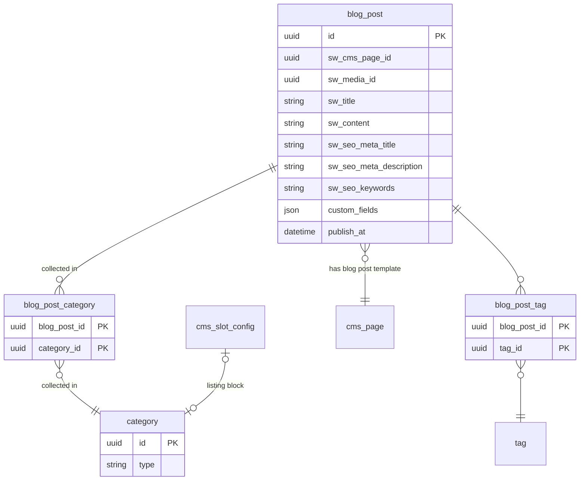
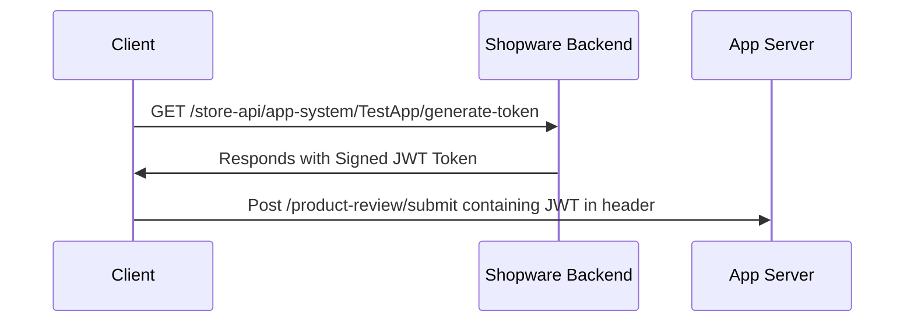

# Mermaid diagram test

```mermaid
erDiagram
    blog_post {
        uuid id PK
        uuid sw_cms_page_id
        uuid sw_media_id
        string sw_title
        string sw_content
        string sw_seo_meta_title
        string sw_seo_meta_description
        string sw_seo_keywords
        json custom_fields
        datetime publish_at
    }
    category {
        uuid id PK
        string type
    }
    blog_post_category {
        uuid blog_post_id PK
        uuid category_id PK
    }
    blog_post_tag {
        uuid blog_post_id PK
        uuid tag_id PK
    }
    blog_post ||--o{ blog_post_category : "collected in"
    blog_post_category }o--|| category : "collected in"
    blog_post }o--|| cms_page : "has blog post template"
    cms_slot_config |o--o| category : "listing block"
    blog_post ||--o{ blog_post_tag : ""
    blog_post_tag }o--|| tag : ""
```

```mermaid
sequenceDiagram
    participant Client
    participant Shopware Backend
    participant App Server
    Client->>Shopware Backend: GET /store-api/app-system/TestApp/generate-token
    Shopware Backend->>Client: Responds with Signed JWT Token
    Client->>App Server: Post /product-review/submit containing JWT in header
```
